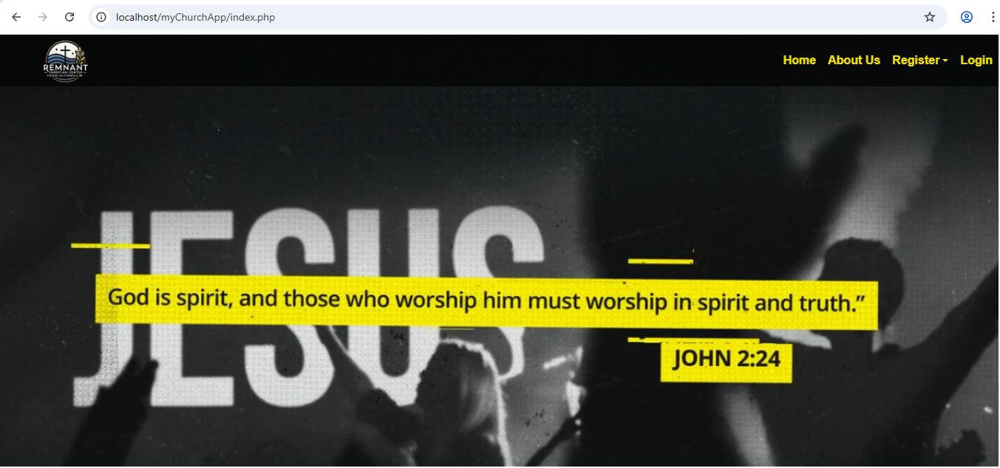
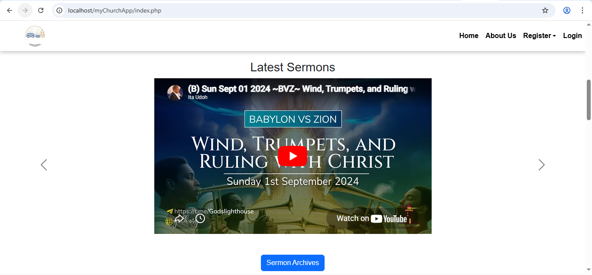
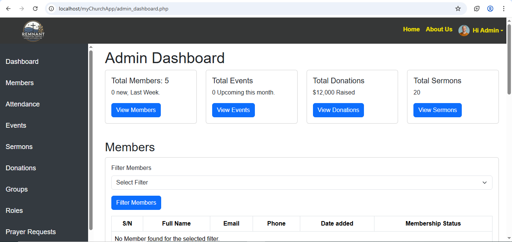
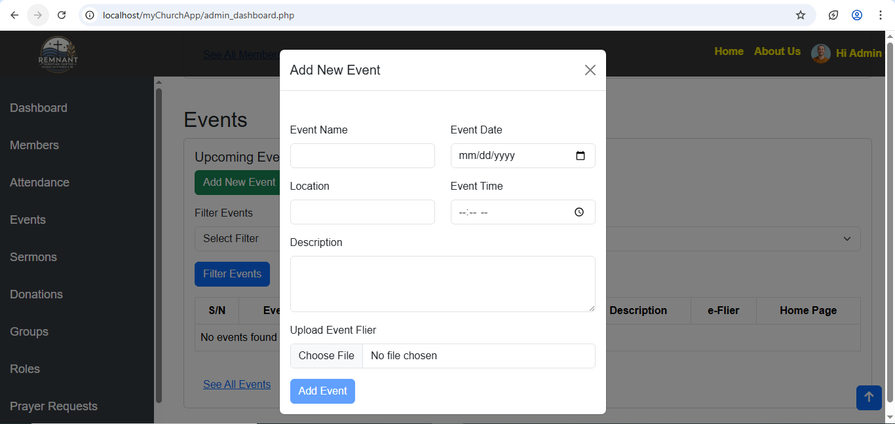
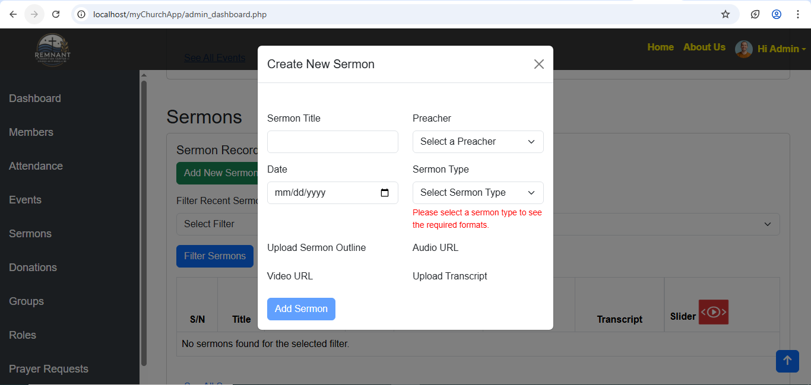

# Church Management System
This project was built to demonstrate practical backend development skills, including database design, authentication systems, and administrative dashboards in a real-world application scenario.

---

## 🚀 Features

- Secure user authentication system (login/logout)
- Admin dashboard for centralized control
- Add, edit, and delete church members
- Create and manage church events
- Record and track donations
- Add, edit, and delete sermons
- Dynamic updates using JavaScript (AJAX)

---

---

## 🛠️ Technologies Used

- **Frontend:** HTML, CSS, Bootstrap, JavaScript  
- **Backend:** PHP  
- **Database:** MySQL  
- **Version Control:** Git & GitHub  

---

## 📁 Project Structure

/css # Stylesheets
/js # JavaScript files
/images # Project images
/sql # Database file
index.php # Main entry point

---

## 📷 Screenshots

### Homepage  
  
  

### Admin Dashboard  
  
  
  

---

## ⚙️ How to Run the Project

1. Install a local server such as XAMPP, WAMP, or Laragon  
2. Clone or download this repository:

git clone https://github.com/Ubee28/church-management-system.git

3. Move the project folder to your server directory (e.g., `htdocs` for XAMPP)  
4. Import the SQL file into your MySQL database  
5. Configure your database connection in the project files  
6. Start Apache and MySQL  
7. Open your browser and go to:

http://localhost/church-management-system

---

## 📌 Notes

- This project is for learning and demonstration purposes  
- No real user data is included  

---

## 👨‍💻 Author

**Elijah Ubong Daniel**  
GitHub: https://github.com/Ubee28
