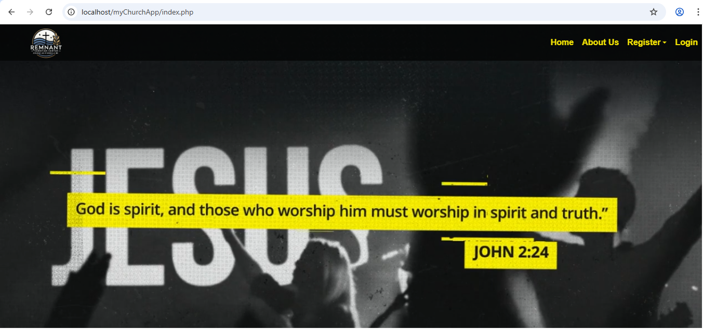
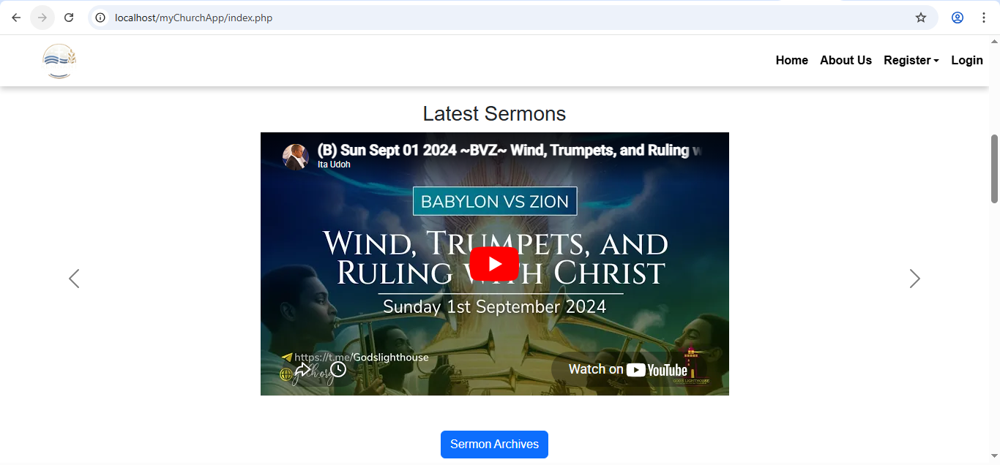
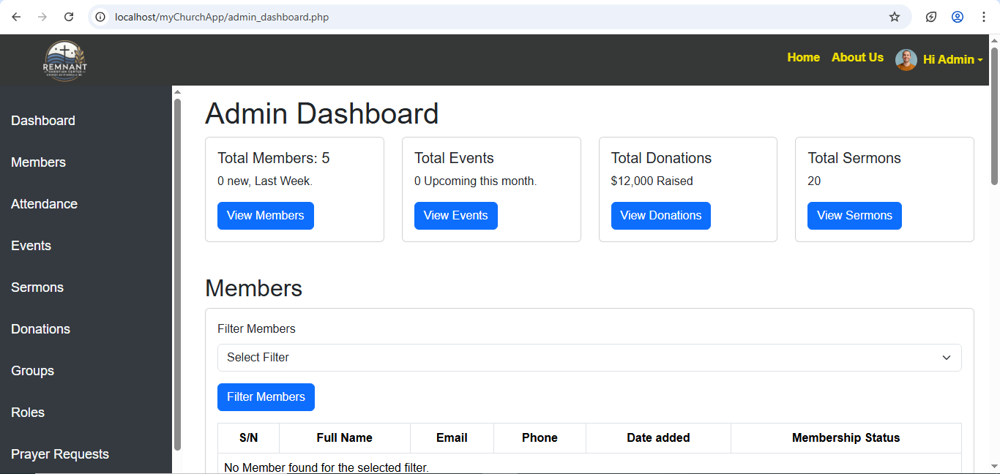
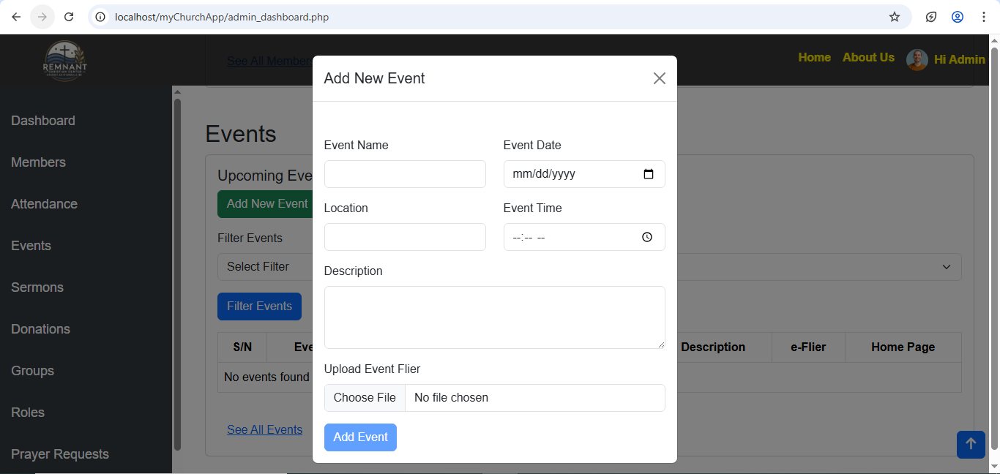
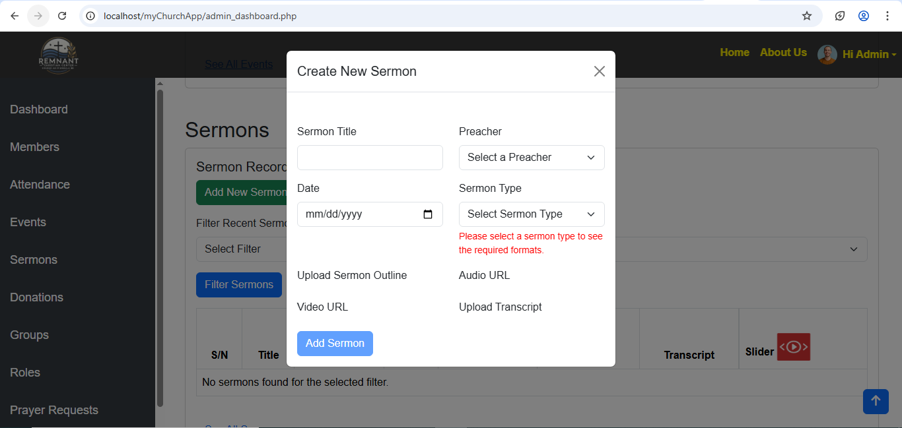

# Church Management System with Paystack Payment Integration
This project was built to demonstrate practical backend development skills, including database design, authentication systems, and administrative dashboards in a real-world application scenario.

---

## 🚀 Project Highlights

- Responsive Church Management System
- Object-Oriented PHP Architecture
- Secure Paystack Payment Integration
- Donation Purpose Management
- Printable Donation Receipts
- Sermon Audio & Video Management
- Member & Admin Dashboards
- Event Management System
- MySQL Database Design
- Bootstrap 5 Responsive Interface

## ✨ Features

### 🔐 Authentication & Authorization
- Secure Admin Login System
- Member Authentication
- Role-based Access Control
- Session Management
- Password Hashing for Improved Security

---

### 👥 Member Management
- Register New Members
- View Member Profiles
- Update Member Information
- Search Members
- Member Dashboard
- Manage Church Membership Records

---

### 📅 Event Management
- Create Church Events
- Edit Existing Events
- Archive Past Events
- Display Upcoming Events
- Member Event Viewing

---

### 🎤 Sermon Management
- Upload Sermons
- Audio Sermon Support
- Video Sermon Support
- Upload Sermon Transcripts
- Upload Sermon Outlines
- Sermon Archive
- Member Sermon Access

---

### 💰 Donation Management
- Online Donations
- Anonymous Donations
- Multiple Donation Purposes
- Secure Paystack Payment Integration
- Payment Verification
- Donation History
- Printable Donation Receipts
- Donation Status Tracking
- Pending, Successful & Failed Payment Status

---

### 🎯 Donation Purpose Management
- Add Donation Purposes
- Edit Donation Purposes
- Activate Donation Purposes
- Deactivate Donation Purposes
- Manage Available Giving Categories

---

### 📊 Admin Dashboard
- Church Statistics Overview
- Member Summary
- Event Summary
- Sermon Summary
- Donation Summary
- Recent Activity Display
- Responsive Sidebar Navigation

---

### 👤 Member Portal
- View Personal Profile
- View Church Events
- Listen to Sermons
- View Donation History
- Access Church Announcements

---

### 📱 Responsive User Interface
- Mobile-Friendly Design
- Responsive Bootstrap 5 Layout
- Modern Dashboard Interface
- Clean User Experience

---

### 🛡️ Security Features
- Input Validation
- Output Escaping using `htmlspecialchars()`
- SQL Injection Protection with Prepared Statements
- Session-Based Authentication
- Authentication Guards for Protected Pages

---

### ⚙️ Technical Features
- Object-Oriented PHP Architecture
- Modular Code Structure
- MySQL Relational Database
- Bootstrap 5 Components
- JavaScript Interactivity
- Paystack Payment Gateway Integration
- Git Version Control

---

---

## 🛠️ Technologies Used

Frontend
- HTML5
- CSS3
- Bootstrap 5
- JavaScript

Backend
- PHP (Object-Oriented)

Database
- MySQL

Payment Gateway
- Paystack

Version Control
- Git
- GitHub

Development Environment
- XAMPP 

---

## 📁 Project Structure

/css # Stylesheets
/js # JavaScript files
/images # Project images
/sql # Database file
index.php # Main entry point

---

## 📷 Screenshots

### Homepage  
  
  

### Admin Dashboard  
  
  
  

---

### Member Dashboard

 

---

### Donationpage

 

---

### Donation Management

---

## ⚙️ How to Run the Project

1. Install a local server such as XAMPP, WAMP, or Laragon  
2. Clone or download this repository:

git clone https://github.com/Ubee28/church-management-system.git

3. Move the project folder to your server directory (e.g., `htdocs` for XAMPP)  
4. Import the SQL file into your MySQL database  
5. Configure your database connection in the project files  
6. Start Apache and MySQL  
7. Open your browser and go to:

http://localhost/church-management-system

---

## 🚀 Future Improvements

- Email Notifications
- SMS Notifications
- Docker Support
- Church Mobile App
- API Development
- Attendance Tracking
- Report Generation

## 📌 Notes

- This project is for learning and demonstration purposes  
- No real user data is included  

---

## 👨‍💻 Author

**Elijah Ubong Daniel**  
GitHub: https://github.com/Ubee28
